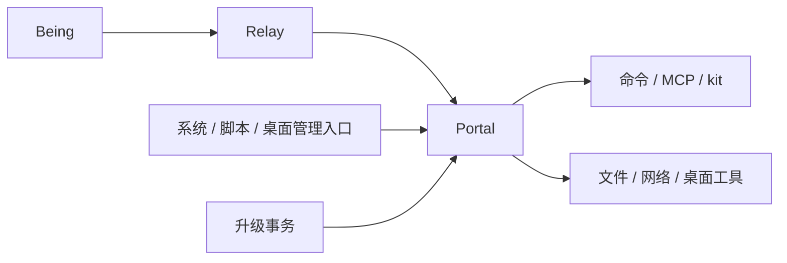
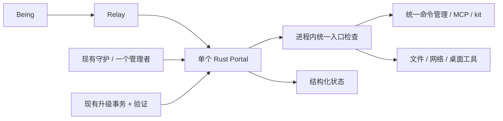
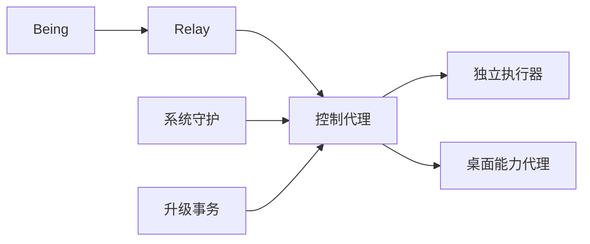
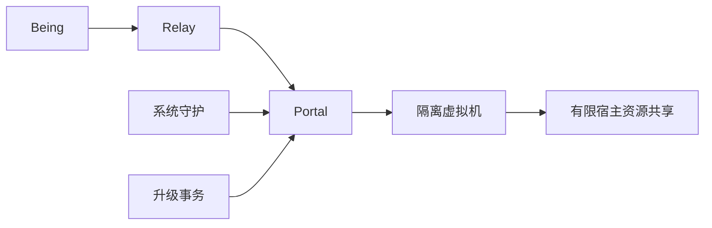

# Security Hardening Proposal: 社区可维护的精简 Portal

## Decision

选择**方案 1：单个 Rust Portal + 现有系统守护 + 明确的执行限制**。我们优先修具体故障，不通过增加常驻进程和协议获得表面上的完整性。一个社区贡献者应能读懂连接、执行、恢复三条路径，并独立运行相应测试。

这份文档取代上一版推荐。当前只是设计，未修改程序或宣称已经通过双平台验证。

## Executive Recommendation

三个选项是：**方案 1：现有单进程补强**；**方案 2：控制代理与独立执行器**；**方案 3：隔离虚拟机执行**。我推荐方案 1。用户已明确精简、稳定、安全和社区维护优先，因此后两个选项不进入默认路线图。

我们保留单个 Rust 程序、TOML 配置、出站 WSS、MCP/kit、现有双平台守护及升级事务。进程内部共用入口校验、执行管理和结构化状态，不额外做 broker、daemon 平台、动态权限引擎或虚拟机调度。

## Evidence

我检查了 Portal `2dab52f` 和当前桌面集成。下面将代码事实与推论分开；完整文件摘要在 [context.md](../context.md)。

| Evidence | Finding or document | What it establishes |
| --- | --- | --- |
| E01 — 连接和请求耦合 | `heart-portal/portal/src/relay_client.rs:250`、`main.rs:650` | Observed：已有心跳/重连；每连接串行等待工具；WS 写共用锁。Inferred：慢工具或写阻塞可能拖延控制请求/恢复。 |
| E02 — 同步执行生命周期 | `heart-portal/portal/src/tools/exec.rs:80`、`exec_policy.rs:171` | Observed：timeout 包住 output，未设置 kill_on_drop，完成后才截断输出。Inferred：超时不保证子进程结束，输出可能先占用大量内存。 |
| E03 — 内存任务及回调 | `heart-portal/portal/src/process_manager.rs:59,369,465` | Observed：后台任务在内存中，有输出环和有限回调重试。重连期间同进程可查询；程序重启不恢复账本。 |
| E04 — 当前用户执行边界 | `heart-portal/portal.example.toml:25`、`tools/custom.rs:1`、`tools/mod.rs:482` | Observed：空 allowlist 允许任意命令，workspace MCP 可启动进程，自定义工具路由先于内置工具。它们不是 OS 沙箱。 |
| E05 — 文件与网络工具 | `heart-portal/portal/src/tools/file.rs:98,298`、`tools/web.rs:111` | Observed：文件检查后另行打开；web_fetch 检查起始 URL 后使用 curl -L。Inferred：最终文件/网络目标和竞态需单独验证。 |
| E06 — 守护与所有权 | `heart-portal/portal/src/single_instance.rs:38`、`scripts/install-portal-task.ps1:45`、`desktop/portal.ts:20` | Observed：已有锁与系统/脚本守护，桌面也有管理入口。Windows Local mutex 是会话范围，需准确说明。 |
| E07 — 升级信任及恢复 | `heart-portal/portal/src/upgrade.rs:148`、`windows_upgrade.rs:323` | Observed：已有校验/回滚；Windows 在线下载验证 GitHub 摘要，无 Authenticode；本地 --file 先执行候选 --version。 |
| E08 — 状态与权限 | `heart-portal/portal/src/connection_status.rs:4`、`tools/permissions.rs:12`、`desktop/external-portal.ts:27` | Observed：已有 ready 与权限查询，但状态发布不完全统一，桌面仍解析日志/TCP 推断在线。 |
| E09 — kit 自恢复 | `heart-portal/portal/src/kits/manager.rs:145,387` | Observed：已有超时/冷却恢复；工具执行释放 manager 锁，但首次连接还会在锁内等待。 |
| E10 — 验证及文档 | `heart-portal/.github/workflows/test.yml:13`、`SECURITY.md:65` | Observed：已有双平台 CI；文档的绝对沙箱承诺不覆盖任意 shell。CI 定义不代表本次测试通过。 |

官方参考保留在证据清单中：我们借鉴 [RustDesk 的权限说明](https://rustdesk.com/docs/en/client/mac/)、[Sparkle 的签名更新](https://sparkle-project.org/documentation/)和 [Windows Job Object](https://learn.microsoft.com/en-us/windows/win32/procthread/job-objects)。这些机制可以局部使用，不要求复制它们的完整产品架构。

## Current Design And Failure Mode

当前 Portal 已经有值得保留的恢复机制。我们真正要解决的是：一次调用何时结束、断线之后是否会重复操作、什么权限实际被授予，以及哪个入口负责重启。

网络断开不必杀 Portal，也不代表已完成的命令失败。后台任务在原进程内仍可存在；同步响应丢失后，操作效果可能不确定。我们先把这些情况准确区分，禁止盲目自动重放，不为追求“任何时候都恢复”立即建设持久调度系统。

安全边界也要诚实：shell、解释器和可写 MCP 配置都能运行用户级代码。我们应集中检查这些入口，保护凭证和安装配置；仅仅增加一个同用户 worker 进程并不能阻止任意代码访问该用户资源。

## Desired Invariants

- 所有执行路径遵守用户显式开启的能力，包括 exec、kit、custom MCP 和管理操作；禁用项不能经其他路由重新启用。
- 超时和取消要终止、等待并回收受管理子进程；无法确认清理完成时明确报错。
- 请求、输出、等待队列、连接与并发有上限；边读边限制，不能先无限收集再截断。
- 网络故障只触发重连，kit 故障只影响该 kit，Portal 崩溃才交给现有守护器恢复。
- 不因响应丢失自动重跑有副作用的调用；没有跨重启记录就如实报告结果未知。
- 一个实例只有一个启动/停止/升级管理者；用户显式停止后不会被另一个守护器拉起。
- 更新候选在任何执行前校验真实性；升级失败可恢复完整旧版本，配置与身份不丢失。

## Constraints And Non-Goals

默认仅承诺登录用户模式。用户睡眠时暂停、注销后停止，权限撤销时对应工具不可用。当前不增加 Windows 系统服务、macOS LaunchDaemon、独立桌面代理或专用特权 helper。

不自研沙箱、不承诺第三方恶意代码的安全托管；不新增设备 PKI、签名 capability、通用服务注册中心、分布式任务调度或默认数据库。未来确有需求再单独设计，不能默认埋扩展框架。

我们允许外部命令、已有 MCP/kit 子进程和升级 worker；“单进程架构”指一个 Portal 核心，不是禁止必要的子进程。复用现有 Python/PowerShell 生命周期代码，不为移除脚本依赖立即重写平台外壳。若干净机器上的依赖问题成为明确障碍，再选择打包依赖或小范围原生替换，并保持单一实现。

## Before Architecture

当前主要路径如下；启动入口代表可选模式，不代表全部同时运行。

## Options

### Option 1: 单进程补强（采用）

我们在同一个程序内共用三处逻辑：请求入口的开关/认证/参数检查；执行模块的启动/超时/输出/回收；状态模块的在线/运行/权限/升级信息。它们是普通 Rust 模块，不新增 RPC 服务和框架。保留 ToolHost、ProcessManager 的结构，逐步合并重复的进程处理代码。

它的安全收益来自消除绕过路径和限制资源，不来自进程隔离。允许任意 shell 仍意味着信任该用户权限下的代码；这个限制应直接写进 README、配置注释和 UI。成本主要是小范围重构、有限缓冲与明确的错误处理，现有安装和 TCC 来源变化较小，社区更容易评审和回退。

我们先修具体问题，每个 PR 带一个对应失败场景。无需等待云端新协议才能修好超时、输出、锁和更新验证。仅当两端需要更准确的调用查询时增加一个稳定 call_id，不扩展成任务平台；若将来确实需要跨重启恢复，再评估一个嵌入式存储。

| Change | Before | After | Security consequence | Cost |
| --- | --- | --- | --- | --- |
| 执行 | 多处独立超时/收集输出 | 共用有界执行与取消 | 降低残留进程和内存耗尽 | 小范围 Rust 重构 |
| 权限 | 内置/自定义入口分别判断 | 路由前统一检查、保留名禁止覆盖 | 减少绕过开关 | 少量规则与回归测试 |
| 恢复 | 多种错误容易混在一起 | 分网络、任务、kit、进程处理 | 避免错误重试与重启 | 统一错误/状态类型 |

#### 最少要修的内容

| 优先项 | 当前落点 | 精简做法 |
| --- | --- | --- |
| 进程清理与限额 | `tools/exec.rs`、`process_manager.rs`、`mcp/connection.rs` | 同步与后台复用启动/取消逻辑；流式输出限额；原子预留并发名额 |
| 连接与阻塞 | `relay_client.rs`、`main.rs`、`kits/manager.rs` | 网络读写有期限；有限请求并发，写响应串行；取消/状态保留容量；kit 冷启动不持全局锁 |
| 权限入口 | `tools/mod.rs`、`tools/custom.rs` | 先检查配置和保留名称，再选路由；可执行插件必须由本地用户启用 |
| 文件与网络 | `tools/file.rs`、`tools/web.rs` | 限制最终目标，验证符号链接/reparse 竞态、DNS 和跳转；需要本地服务时显式配置具体 endpoint |
| 状态与管理 | `connection_status.rs`、平台脚本、桌面观察器 | 复用 JSON 状态文件，加代次/时间；原子写入；status --json；不再以工具日志作为状态事实 |
| 更新 | `upgrade.rs`、`windows_upgrade.rs`、现有 worker | 验证先于 --version；保留事务锁、备份、回滚；本地启动健康与互联网状态分开 |

我们不为本地服务再建设注册平台：已有 kit 能表达的集成继续用 kit；新增适配器只暴露具体操作和明确 endpoint。公网 fetch 不能因为要支持一个本地服务就全局放开内网访问。

#### 最小权限规则

新安装明确由用户开启命令和可执行扩展，不能以“空 allowlist”暗示受限执行；已有用户保留原配置和行为，迁移时说明含义。exec/custom MCP/kit 分别有现成开关，但所有调用先走同一个入口检查。workspace 写入不应自动激活新的可执行配置：只有启用 custom MCP 的可信用户模式允许它，权限含义必须清楚。

使用普通用户权限；敏感文件保持已有 0600/Windows ACL，凭证不写入日志、启动参数和不必要的子进程环境。不要让安装目录和普通可写 workspace 混用。通用 shell 是显式信任模式，allowlist 不当作 OS 沙箱，node/python/git 等工具不能仅凭名称认定安全。

远程连接使用现有 WSS 认证；URL 用标准解析器，loopback 明文例外精确匹配。独立本地 TCP 模式只绑定 loopback，并要求 token 或用户显式选择无认证开发模式；不默认向 LAN 暴露命令入口。保留清晰的认证错误，不通过关闭 TLS 验证解决网络问题。

#### 断线、超时和结果

我们先定义简单、可执行的契约：断线后重连，不自动重放工具调用；已接受的后台任务在同一进程里继续到自己的限制，Being 可以查询 session；同步响应丢失则标记“结果未知”，提醒调用方先检查操作结果。Portal 重启后，旧 session 返回“会话已丢失/结果未知”，不能报告没执行过。

调用方也必须遵守不盲重试的契约，Portal 单方面无法阻止 Being 用新请求重复操作。需要去重时，两端协商一个跨重连稳定的 call_id，Portal 用有大小/期限上限的内存记录缓存参数摘要与状态；重复 ID 参数不同则拒绝。JSON-RPC 的连接内 id 不能直接充当这个 ID，跨重启不做幂等保证。

保持现有有限回调重试与 poll 备用查询，明确它是尽力交付。若产品实际需要“重启后结果也绝不丢”，再引入单个 SQLite 文件和很小的任务/outbox 表；在那之前不宣称持久交付。这比先建设调度系统更容易维护，也不会掩盖结果未知的事实。

#### macOS 与 Windows

| 方面 | macOS | Windows |
| --- | --- | --- |
| 守护 | 复用现有 LaunchAgent/会话 supervisor | 复用 Limited/Interactive 登录任务和现有 supervisor |
| 运行身份 | 普通登录用户；保持现有签名与启动来源 | 普通登录用户；不默认管理员/LocalSystem |
| 子进程清理 | 独立 process group，TERM → 限时 KILL → 回收 | Job Object 管进程树，运行代码前完成关联；句柄不泄漏/不继承 |
| 桌面权限 | 保留实际调用者的权限探测；缺权限只禁用相关能力 | 在当前用户会话执行；锁屏/注销不可用就明确报错 |
| 升级 | 继续验证发布签名与恢复事务，保持路径/身份 | 验证下载包及本地候选真实性，处理 exe 占用和失败回滚 |
| 可用范围 | 登录后运行，睡眠暂停、注销停止 | 登录后运行，睡眠/休眠暂停、注销停止 |

process group 和 Job Object 管生命周期，不能代替任意代码安全隔离。macOS 脚本主动脱离 group 等场景，要准确记录限制；不能通过文档承诺全进程树绝对可控。Windows 不通过 taskkill 的进程名匹配误杀无关进程。

每个实例固定一个 manager：独立安装由原管理方式管理，桌面只观察；明确选择桌面托管时才由桌面管理。复用现有锁，检查 stop/restart/upgrade 的所有权；不为此先新增 RPC 控制服务。状态文件只用于观察，不作为高权限授权依据。

#### 更新与社区发布

保留现有升级事务。候选包必须在执行任何代码前验证：官方自动更新使用可信发布元数据/签名和平台/版本匹配，本地 --file 必须有可信签名证明，不能把运行 --version 当成安全验证。无法验证的社区构建走明确的开发者手工安装流程，不进入静默自动更新。

签名验证复用成熟库/平台 API，不自写密码学。macOS 保持 Developer ID/发布身份；Windows 官方包补齐发布签名，发布密钥与源码仓库分离，社区贡献者不需要发布私钥也能构建测试。在线 SHA-256 校验保留，但它不能抵御发布仓库本身被替换。

本地初始化成功才提交升级，外网故障不回滚二进制；权限变化明确提示，避免升级/回滚循环。配置兼容、旧版本备份、脚本与二进制同步回退沿用已有实现，不引入第二套更新器。

### Option 2: 控制代理与独立执行器（暂缓）

当多个独立调用者确实需要共享运行时，或必须隔离某类崩溃时，我们才考虑把执行拆出进程。它能缩小故障范围，但引入 IPC 认证、组件版本配对、安装管理与更多恢复状态，同用户运行仍不提供安全隔离。

当前这些代价不符合社区精简目标。若未来采用，应由实际失败案例驱动，只拆需要隔离的一部分；回退前停止接单并处理在途调用，不悄悄扩大执行权限。

| Change | Before | After | Security consequence | Cost |
| --- | --- | --- | --- | --- |
| 执行进程 | 与 Portal 管理逻辑耦合 | 独立执行器 | 隔离部分崩溃；同用户权限保留 | IPC、更多进程、版本契约 |

### Option 3: 隔离虚拟机执行（不在当前产品范围）

如果产品未来要托管不可信第三方代码，虚拟机比同用户子进程有更实质的隔离边界。但镜像、内存、磁盘、宿主共享和桌面/GPU 兼容都要维护，这会把 Portal 变成另一类产品。

当前不实现，也不预埋后端框架。需要这类运行环境时优先让部署者在外部配置；Portal 准确声明自己的信任边界。未来若单独采用，禁用隔离后端时不能自动降级为宿主任意执行。

| Change | Before | After | Security consequence | Cost |
| --- | --- | --- | --- | --- |
| 任意代码 | 宿主用户权限 | 虚拟机边界 | 降低宿主污染，但共享资源仍有风险 | 镜像、资源、兼容与运维 |

## Comparison

我们不使用未经测量的性能数字选择架构。以下方向判断仍需对应测试。

| Dimension | 方案 1 | 方案 2 | 方案 3 |
| --- | --- | --- | --- |
| Security | 收敛入口/资源边界；可信 shell 权限保留（source-derived，高） | 多进程故障隔离，安全隔离另需主体边界（source-derived，中） | 任意代码隔离更强，宿主共享仍需约束（analogous，中） |
| Performance | 无新增跨进程调用，限额/调度开销待测（hypothetical，中） | 增加 IPC/序列化（hypothetical，中） | 增加虚拟机启动/共享 IO（hypothetical，中） |
| Memory | 流式限额降低无界峰值，净效果待测（source-derived，中） | 额外常驻进程（hypothetical，中） | guest 和镜像增加开销（analogous，高） |
| Reliability | 修复明确故障，核心进程仍共享影响（source-derived，中） | 隔离部分崩溃，也新增 IPC 失败点（hypothetical，中） | 可重建环境，同时增加运行依赖（hypothetical，中） |
| Operability | 延续现有安装与诊断（source-derived，高） | 需要多组件版本/安装管理（source-derived，中） | 需要镜像/容量/共享运维（analogous，中） |
| Migration | 小 PR 渐进、保留协议（source-derived，高） | 多边界迁移（source-derived，中） | 工具和资源迁移（hypothetical，中） |

验证用同样命令/kit 的延迟、峰值内存、句柄数、长期增长和故障恢复比较。新增一层只有在实测证明解决了当前结构难以解决的问题时才值得采用。

## Recommendation

我推荐方案 1。最值得投入的是共用执行器代码、正确的取消/资源限制、入口权限检查和小而准确的状态，而不是新增运行服务。跨重启任务结果、系统级无人值守和第三方代码隔离是需要真实需求才能启动的独立设计。

## Evidence Coverage And Residual Risk

下表是设计覆盖，不是已修复声明。addresses 表示目标机制有对应修复；mitigates 只降低影响。所有直接修复都需要针对性回归。

| Evidence | 方案 1 | 方案 2 | 方案 3 | 必须保留的措施/限制 |
| --- | --- | --- | --- | --- |
| E01 — 连接和请求耦合 | addresses | addresses | addresses | 有界读写和调度 |
| E02 — 同步执行生命周期 | addresses | addresses | addresses | 终止/回收、流式限额 |
| E03 — 内存任务及回调 | mitigates | mitigates | mitigates | 不盲重试；持久结果当前不承诺，拆进程/VM 本身也不解决 |
| E04 — 当前用户执行边界 | mitigates | mitigates | mitigates | 明确授权、统一入口、可信 shell 边界 |
| E05 — 文件与网络工具 | addresses | addresses | mitigates | 最终资源校验，VM 不能代替宿主接口修复 |
| E06 — 守护与所有权 | addresses | addresses | addresses | 一个 manager，准确的实例范围 |
| E07 — 升级信任及恢复 | addresses | addresses | addresses | 验证先于执行，完整回滚 |
| E08 — 状态与权限 | addresses | addresses | addresses | 结构化新鲜状态，权限按能力降级 |
| E09 — kit 自恢复 | addresses | addresses | addresses | 冷启动不持全局锁、单 kit 恢复 |
| E10 — 验证及文档 | mitigates | mitigates | mitigates | 实机验证与真实能力说明 |

## Migration And Rollout

采用现有安装和权限来源，小 PR 逐个发布：先执行清理/资源限额，再入口策略/错误，随后状态/所有权，最后完成签名更新与故障回归。安全修复不要等待架构重构。

旧配置不静默改变权限，新的默认值只作用于新安装。若引入 call_id，必须和 Heart/relay 协商，旧接口仍准确报告结果未知。回退保留旧配置和签名版本，不通过关闭安全检查兼容旧行为；无新增任务数据库就没有额外数据格式迁移。

## Validation Plan

复用已有 Rust 和平台脚本测试，只增加能捕捉实际故障的测试。

| 场景 | 必须通过 |
| --- | --- |
| 超时、取消、多层子进程 | 受管理进程按期限结束并回收；不误杀无关进程；异常清理有明确错误 |
| 大输出、无换行、请求过载 | 读取时限额生效，内存/句柄不持续增长，状态/取消可用 |
| 断网、半开、睡眠唤醒 | 自动重连；不自动重放命令；同进程后台任务仍可查询 |
| 一个 kit 卡死或缺依赖 | 其他工具可用，恢复只作用于该 kit |
| 关闭 UI、重复启动、显式 stop | 一个 manager；独立后台安装不依赖窗口；stop 后不被拉起 |
| TCC 撤销、锁屏、注销 | 对应能力准确不可用，不反复重启整个 Portal |
| 错签名、损坏更新、exe 占用、更新中断 | 验证前不执行候选，失败保留或恢复旧版本 |
| 关闭执行入口、插件同名、文件/网络越界 | 配置生效，保留名拒绝，最终目标校验有反例覆盖 |

在实际支持的 macOS/Windows 版本、普通用户、中文/空格路径上运行；保留干净机器安装和已有版本升级测试。发布候选进行连续运行和多次睡眠/换网，比较 CPU、内存、FD/handle 与恢复时间。没有这些结果就不宣称“保证稳定”。

## Implementation Work Packages

| 小 PR | 文件范围 | 完成条件 |
| --- | --- | --- |
| 执行生命周期 | `tools/exec.rs`、`process_manager.rs`、`exec_policy.rs` | 同步/后台共用必要逻辑，取消和输出测试通过 |
| 连接/kit 阻塞 | `relay_client.rs`、`main.rs`、`kits/manager.rs` | 有界并发与写入，控制消息不被长工具阻塞 |
| 权限与工具边界 | `tools/mod.rs`、`tools/custom.rs`、`tools/file.rs`、`tools/web.rs`、配置/文档 | 开关和最终资源校验一致；trusted shell 说明准确 |
| 状态与所有权 | `connection_status.rs`、现有平台脚本、桌面观察器 | 原子状态记录，单 manager，stop/restart 契约通过 |
| 更新真实性 | `upgrade.rs`、`windows_upgrade.rs`、现有升级脚本 | 所有候选执行前验证，正常/中断回退测试通过 |

这些是代码落点，尚未实施；不需要新增实施平台或通用插件框架。

## Open Questions

未来只有三类需求值得重新评估架构：必须跨 Portal 重启保留任务结果、必须注销后运行、必须安全托管不可信第三方代码。在这些需求出现之前，我们采用上述边界，不预建对应系统。
